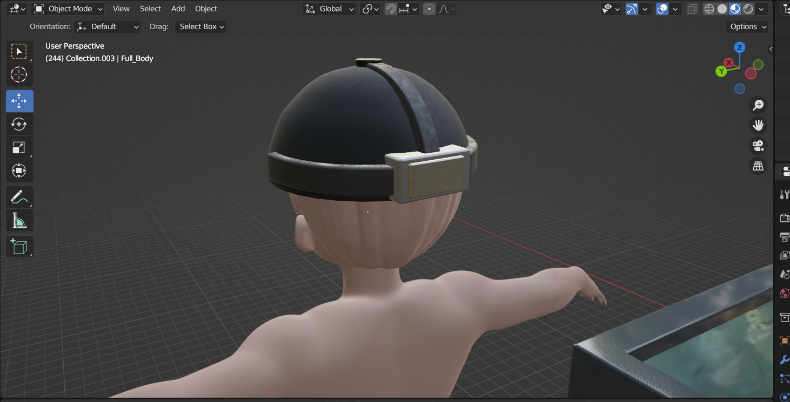

• In Paralympic specifically in swimming events, blind swimmers depend on human "Tappers" who stand nearby on the end of the poolside and use a one-long pole to tap the swimmers to signal when to turn and finish.  ​

​

• This method can affect the swimmer’s performance, so our idea is to replace the system with a sensors and give them a live statistics, which they fitted with the belt and cap. ​

​

• When swimmers approach the wall, an ultrasonic sensor detects with a certain distance of approach giving an alert in the cap and when they are out of track message is given in the belt.
giveing the solution to the blind swimmers 

hardwares: 

just assume that he is blind swimmer and he is wearing that swimming cap which is integrated with the sensors and microcontroller

